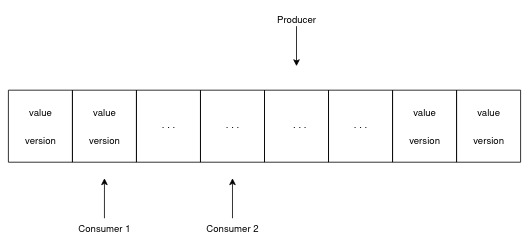

# seqlock-queue

## Introduction

An implementation of a `SeqlockQueue` in C++11.

A `Seqlock` is an alternative to a readers-writer lock, ensuring that the writer is never blocked.
This makes it particularly suitable for scenarios where you need to share state among multiple threads.
By aggregating multiple `Seqlocks`, you can create a `SeqlockQueue`, facilitating efficient sharing of individual
updates.

The `SeqlockQueue` is a single-producer multiple-consumer ring buffer with N slots, each equipped with its
own `Seqlock`.

- The producer is lock-free and wait-free.
- The consumers are lock-free and will receive all updates, similar to a multicast approach.
- Slow consumers may drop messages if they cannot keep up with the pace of updates.

Please be aware that the current version of SeqlockQueue is designed for x86 architecture only.

